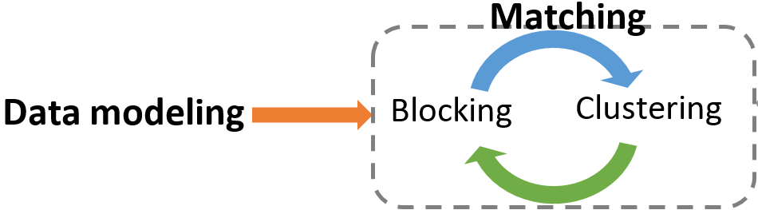

#Swash: A Collective Personal Name Matching Framework

Swash is a personal name matching framework which inspired by the human thinking. Swash has several main features:
* **Collective**: Instead pairwise matching, it utilizes information available in whole data and matching decisions dependent on each other. 
* **Accurate**: Swash outperforms state-of-the-art performance, particularly on more difficult datasets. 
* **Unsupervised**: No need to labeled data. Neither matching gold standard nor name structure (firstname, lastname, and etc).
* **Self-trainable**: gradually predicting name structure tags according to confident tags.
* **Considering dissimilarity**: instead of reference similarity, the consistency concept is defined. The consistency considers the dissimilarity in addition to similarity.

## Matching Process
Swash framework consists of two major phases: 
1. _Data modeling_: Names are transformed into a rich HIN (Heterogeneous Information Network).
2. _Matching_: This phase alternates between the blocking stage, which finds possible candidate names, and clustering stage, which clusters the candidates.

We implement the _data modeling phase_ using R language, which is publicly available on: https://github.com/MohsenIT/swash-data-modeling
The _matching phase_ is implemented with Java, and it is available in [the current repository](https://github.com/MohsenIT/swash-matching).